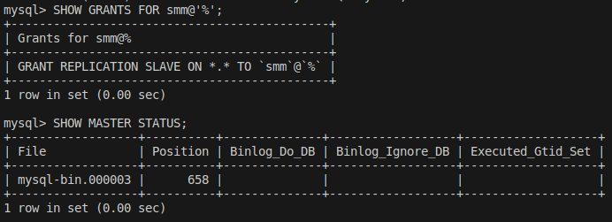
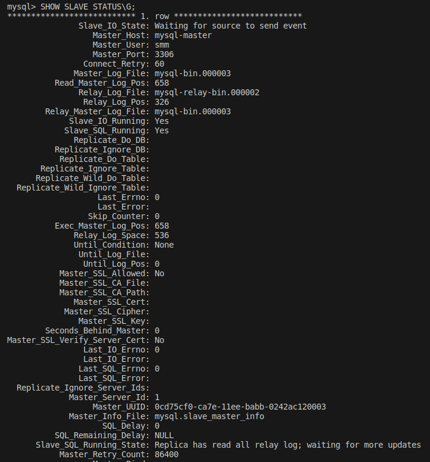
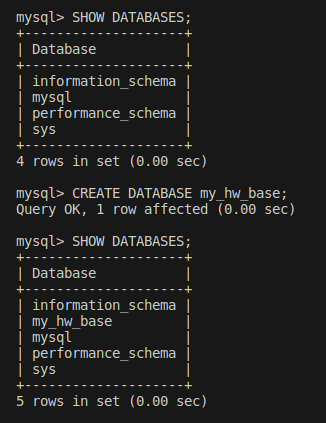
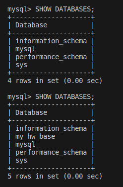

# Домашнее задание к занятию «Репликация и масштабирование. Часть 1» - Михалёв Сергей

---

### Задание 1

На лекции рассматривались режимы репликации master-slave, master-master, опишите их различия.

**Решение**

Основное отличите между *master-slave* и *master-master* заключается в работе с данными. *master-slave* Предполагает работу с мастером только для запиис или изменения данных (*INSERT/UPDATE/DELETE*), чтение же данных производится со slave. В случае схемы *master-master* любой из серверов может использоваться как для чтения так и для записи.
Преимуществом *master-slave* является возможность использования множества серверов *slave* (не рекомендуется использовать более 20) для работы с одним сервером *master*, что снижает общую нагрузку.  
Система *master-slave* считается наиболее безопасной в поане сохранности данных. В случае выхода из строя *master*, нужно переключить все операции (и чтения и записи) на *slave*. Таким образом он станет новым *master*. Данные при этом не теряются. В случае *master-master* выход из строя одного из серверов практически всегда приводит к потере каких-то данных. Последующее восстановление также сильно затрудняется необходимостью ручного анализа данных, которые успели либо не успели скопироваться.

---

### Задание 2

Выполните конфигурацию master-slave репликации, примером можно пользоваться из лекции.

*Приложите скриншоты конфигурации, выполнения работы: состояния и режимы работы серверов.*

**Решение**

В докере запустил сервер мастера. Создал пользователя и настроил мастера. Чтение бинарного файла mysql-bin.000003 *slave* должен начать со строки 658.

Запустил сервер слэйва, указал настройки для подключения с мастеру. Ниже приведена "портянка" без ошибок.

Создал на мастере базу *my_hw_base*.

*slave* прочитал данные из файла mysql-bin.000003 и воспроизвёл изменение у себя.

---
